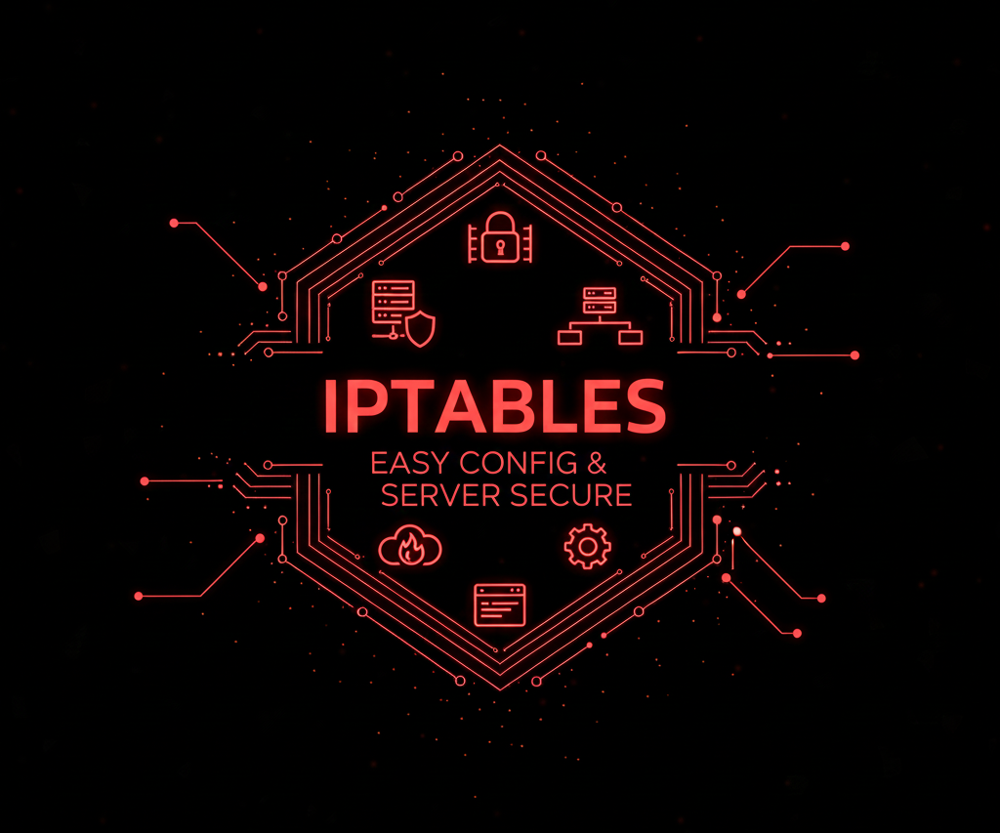

## Iptables-secure

<p align="center">
  
</p>

**iptables** es una herramienta de firewall para sistemas Linux que permite configurar y gestionar reglas de filtrado de paquetes en el kernel. Este proyecto incluye un script para configurar iptables de manera fácil y rápida, manteniendo tu servidor seguro.

---

## ⚙️ Requisitos

- Sistema operativo: Linux (Ubuntu/Debian recomendado)
- Python 3.8 o superior
- Permisos de administrador (sudo)

---

## 🚀 Instalación

Clona el repositorio y accede al directorio:

```bash
git clone https://github.com/Devsebastian31/Iptables-secure.git
cd Iptables-secure
```

---

## ▶️ Uso

Ejemplo de salida esperada:

```bash
sudo python3 Iptables.py
```

---

## 📜 Licencia

Este proyecto está bajo la licencia GPL. Puedes usarlo libremente con fines educativos y de investigación.
