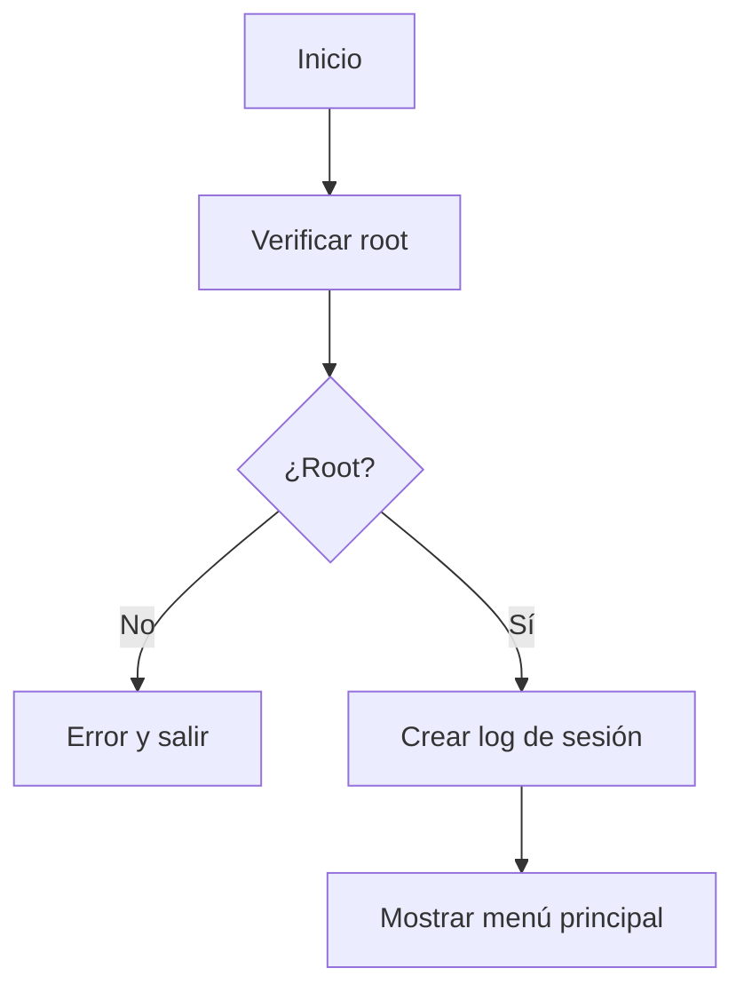
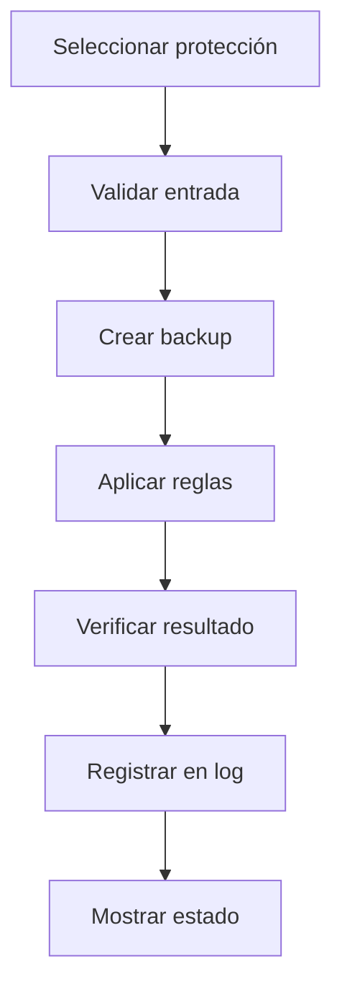
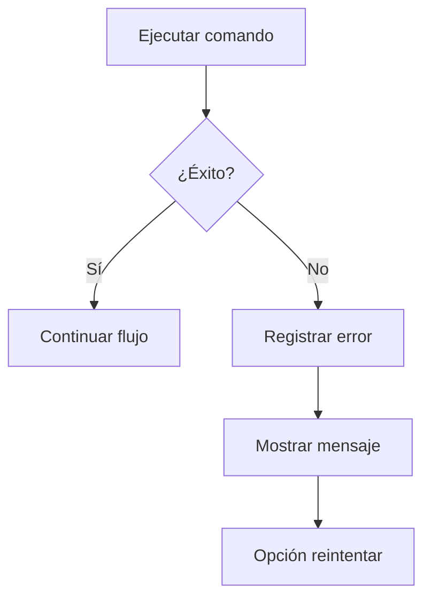

# Arquitectura de Iptables Secure Manager

## Visión General

Iptables Secure Manager es una herramienta educativa de ciberseguridad diseñada para la gestión profesional de firewalls iptables en sistemas Linux. La arquitectura sigue principios DevSecOps con un enfoque ético y defensivo.

## Estructura del Sistema

### Componentes Principales

```
┌─────────────────────────────────────────────────────────────┐
│                    Iptables Secure Manager                   │
├─────────────────────────────────────────────────────────────┤
│  Capa de Presentación (CLI Interactiva)                     │
│  ├── Menú principal                                         │
│  ├── Validación de entradas                                 │
│  └── Interfaz de usuario                                    │
├─────────────────────────────────────────────────────────────┤
│  Capa de Lógica de Negocio                                  │
│  ├── Validaciones (IP, puerto)                              │
│  ├── Gestión de reglas iptables                             │
│  ├── Sistema de backups                                     │
│  └── Logging y auditoría                                   │
├─────────────────────────────────────────────────────────────┤
│  Capa de Sistema Operativo                                  │
│  ├── Comandos iptables                                      │
│  ├── Permisos root                                          │
│  └── Persistencia de reglas                                │
└─────────────────────────────────────────────────────────────┘
```

## Módulos Funcionales

### 1. Gestión de Protecciones

#### SYN Flood Protection
- **Propósito**: Prevenir ataques de inundación SYN
- **Implementación**: Límite de 5 conexiones SYN por segundo
- **Reglas iptables**:
  ```bash
  iptables -A INPUT -p tcp --syn -m limit --limit 5/s -j ACCEPT
  iptables -A INPUT -p tcp --syn -j DROP
  ```

#### SSH Access Control
- **Propósito**: Restringir acceso SSH a IPs autorizadas
- **Implementación**: Lista blanca de direcciones IP
- **Validación**: Detección automática de IP actual del usuario

#### DoS Prevention
- **Propósito**: Limitar conexiones HTTP simultáneas
- **Configuración**: Límites personalizables de conexiones
- **Mecanismos**: connlimit y rate limiting

#### Port Scanning Detection
- **Propósito**: Detectar y bloquear escaneos de puertos
- **Tipos detectados**: NULL, FIN, XMAS, SYN-RST scans
- **Implementación**: Cadena personalizada SCANNER_PROTECTION

### 2. Sistema de Validación

#### Validación de IPs
```python
def validar_ip(ip):
    patron = r'^(\d{1,3}\.){3}\d{1,3}$'
    if re.match(patron, ip):
        octetos = ip.split('.')
        return all(0 <= int(octeto) <= 255 for octeto in octetos)
    return False
```

#### Validación de Puertos
```python
def validar_puerto(puerto):
    try:
        puerto_num = int(puerto)
        return 1 <= puerto_num <= 65535
    except ValueError:
        return False
```

### 3. Sistema de Backups

#### Automático
- **Disparador**: Antes de cualquier cambio en reglas
- **Formato**: `iptables_backup_YYYYMMDD_HHMMSS.rules`
- **Contenido**: Estado completo de iptables

#### Restauración
- **Interfaz**: Menú integrado de recuperación
- **Validación**: Confirmación explícita del usuario
- **Rollback**: Reversión segura al estado anterior

### 4. Logging y Auditoría

#### Formato de Logs
```
[TIMESTAMP] ACCIÓN: descripción detallada
[TIMESTAMP] BACKUP: creado archivo iptables_backup_20240209_143022.rules
[TIMESTAMP] SSH: permitido acceso desde 192.168.1.100
```

#### Archivos de Log
- **Principal**: `iptables_rules.log`
- **Rotación**: Manual por tamaño o tiempo
- **Contenido**: Todas las operaciones con timestamps

## Flujo de Operaciones

### 1. Inicialización


### 2. Flujo de Protección


### 3. Manejo de Errores


## Consideraciones de Seguridad

### 1. Validación de Entradas
- **Sanitización**: Todas las entradas del usuario
- **Prevención**: Inyección de comandos
- **Validación**: Formato y rango de valores

### 2. Principio de Mínimo Privilegio
- **Ejecución**: Solo con permisos root necesarios
- **Alcance**: Operaciones específicas de iptables
- **Auditoría**: Registro de todas las acciones

### 3. Persistencia Segura
- **Backups**: Antes de cambios destructivos
- **Confirmación**: Doble verificación del usuario
- **Rollback**: Recuperación automática

## Configuración y Despliegue

### Requisitos del Sistema
- **SO**: Linux (Ubuntu/Debian recomendado)
- **Python**: 3.8 o superior
- **Permisos**: Root para ejecución
- **Dependencias**: iptables, netfilter-persistent

### Instalación
```bash
# Clonar repositorio
git clone https://github.com/Devsebastian31/Iptables-secure.git
cd Iptables-secure

# Instalar dependencias
sudo apt update
sudo apt install iptables netfilter-persistent -y

# Ejecutar
sudo python3 src/Iptables.py
```

## Testing y Validación

### Tests Unitarios
- **Validaciones**: IP, puerto, formatos
- **Funciones**: Logging, backup, comandos
- **Cobertura**: >80% del código principal

### Tests de Integración
- **Flujo completo**: Menú a ejecución
- **Simulación**: Comandos iptables mock
- **Seguridad**: Inyección y validación

### Tests de Seguridad
- **Análisis estático**: Bandit, Safety
- **Vulnerabilidades**: Dependencias y código
- **Penetration testing**: Validación ética

## Métricas y Monitoreo

### Indicadores Clave
- **Rendimiento**: Tiempo de respuesta
- **Disponibilidad**: Estado del servicio
- **Seguridad**: Intentos bloqueados
- **Uso**: Operaciones por sesión

### Alertas y Notificaciones
- **Errores críticos**: Fallas en ejecución
- **Cambios**: Modificaciones de reglas
- **Seguridad**: Detección de amenazas

## Mejoras Futuras

### 1. Interfaz Web
- **Dashboard**: Visualización de reglas
- **Gráficos**: Estadísticas de uso
- **API**: Integración con sistemas

### 2. Machine Learning
- **Detección**: Patrones anómalos
- **Predicción**: Ataques emergentes
- **Adaptación**: Reglas dinámicas

### 3. Integración DevSecOps
- **CI/CD**: Pipeline automatizado
- **IaC**: Infrastructure as Code
- **Compliance**: Validación automática

---

**Nota**: Esta arquitectura está diseñada para fines educativos y de investigación en ciberseguridad. El uso en producción requiere validación adicional y consideraciones específicas del entorno.
